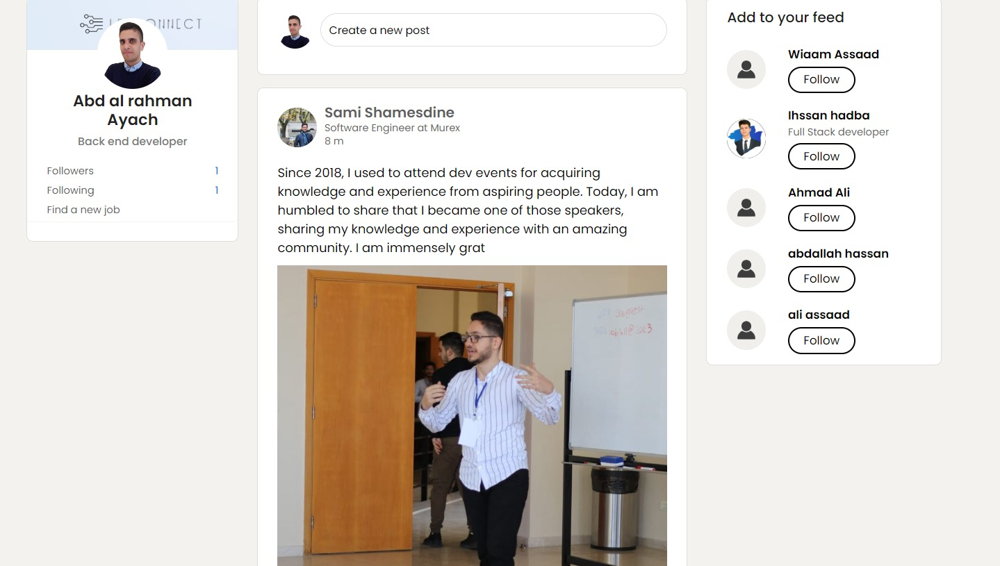
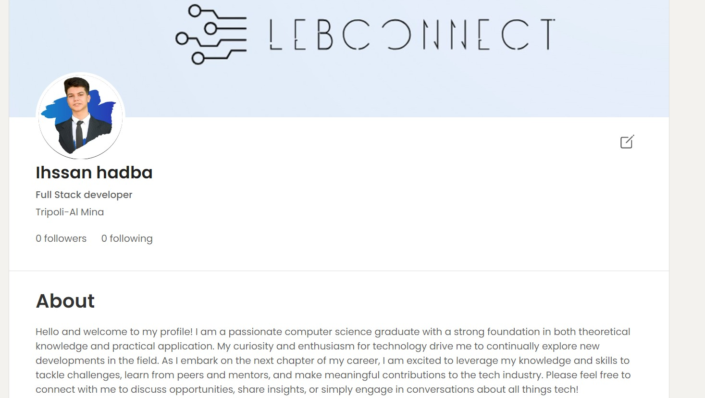
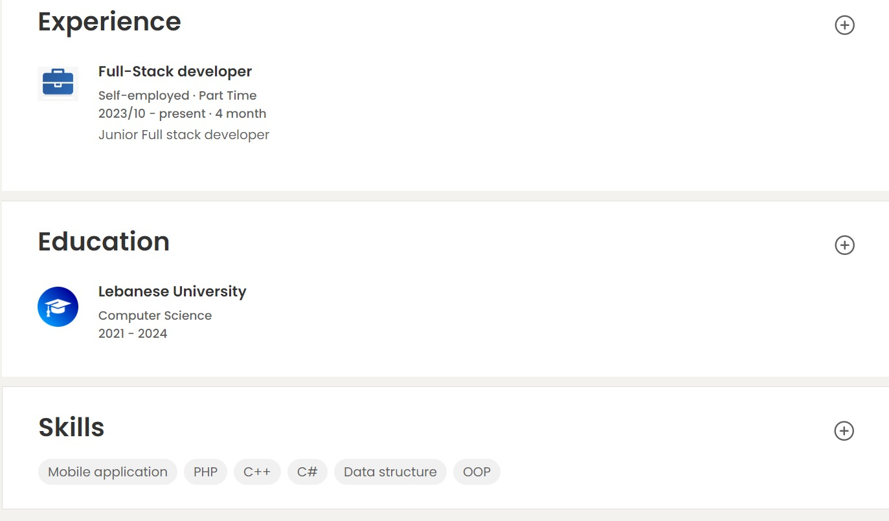

## Screenshots

## 1.Home Page



## 1.Login Form


### 2. Profile Overview (Up to About Section)



### 3. Experience, and Education, Skills



## Features

- User authentication (login and registration)
- Create and edit user profiles
- Follow other users
- Create posts
- View user posts and interactions

## Technologies Used

- HTML, CSS, JavaScript
- PHP (Pure PHP)
- MySQL
- MVC Architecture
- Phinx (Database Migrations)
- PHP Router (Routing)

## Installation

1. Clone the repository:
   ```bash
   git clone https://github.com/username/lebconnect.git
   ```
2. Navigate to the project folder:
   ```bash
   cd lebconnect
   ```
3. Install dependencies (if any):
   ```bash
   composer install
   ```
4. Set up the database by running migrations:
   ```bash
   php migration.php
   ```
5. Open the project in your browser:
   ```bash
   http://localhost/lebconnect
   ```

Make sure your PHP server and MySQL database are running.

## Usage

- To access the app, visit `http://localhost/lebconnect`.
- Log in with your credentials or register for a new account.
- Edit your profile and start interacting with the platform!
